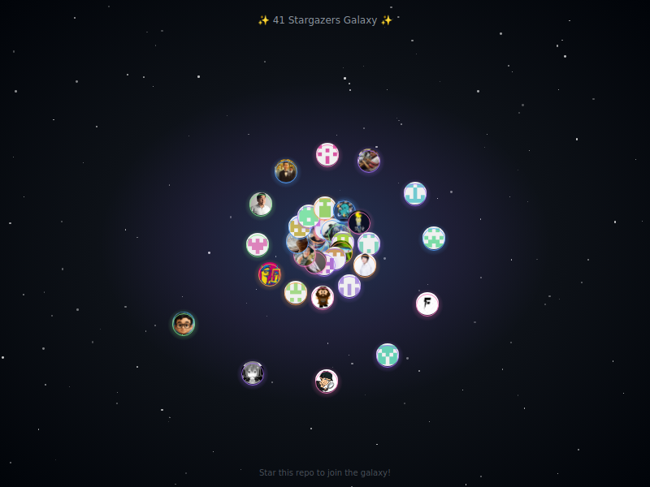

# Muripo HQ

> 用最不正經的方式，做最省事的工具。

**30 天 30 Repo 挑戰** — 2025/11/30 ~ 2025/12/29

🔗 **[前往 Muripo HQ](https://tznthou.github.io/muripo-hq/)**



> ⭐ **Star 這個 Repo，你就會出現在銀河裡！**

---

## 已完成專案

| Day | 名稱 | 類型 | 說明 |
|-----|------|------|------|
| 01 | [Compress](https://github.com/tznthou/day-01-compress) | web | 圖片壓縮工具 |
| 02 | [kebab-rename](https://github.com/tznthou/kebab-rename) | cli | 一鍵把檔名轉成 kebab-case |
| 03 | [counter](https://github.com/tznthou/day-03-counter) | web | 日常步數記錄器 PWA |
| 04 | [password](https://github.com/tznthou/day-04-password) | web | 暗黑密碼鍛造爐 - 遊戲化密碼產生器 |
| 05 | [ghost-radar](https://github.com/tznthou/ghost-radar) | cli | 重複檔案抓鬼雷達 |
| 06 | [json-salon](https://github.com/tznthou/muripo-day06-json-salon) | web | JSON 美容院 - 格式化工具 |
| 07 | [neon-drum](https://github.com/tznthou/day-07-neon-drum) | web | 霓虹動態鼓機 - Webcam 揮手觸發 |
| 08 | [game-of-life](https://github.com/tznthou/day-08-game-of-life) | web | Conway 生命遊戲 - d3.js 細胞自動機 |
| 09 | [voice-ripple](https://github.com/tznthou/day-09-voice-ripple) | web | 聲控漣漪鋼琴 - 音你而起的漣漪 |
| 10 | [rhythm-catcher](https://github.com/tznthou/day-10-rhythm-catcher) | web | AR Rhythm Catcher - 體感節奏捕捉 |
| 11 | [file-organizer](https://github.com/tznthou/day-11-file-organizer) | cli | 檔案整理大師 - 統計報告與羞辱榜 |
| 12 | [workday](https://github.com/tznthou/day-12-workday) | web | 工作日計算器 - 排除台灣假日 |
| 13 | [cyber-glitch](https://github.com/tznthou/day-13-cyber-glitch) | extension | 網頁現實駭客 - Cyberpunk 故障模式 |
| 14 | [simple-console-mcp](https://github.com/tznthou/simple-console-mcp) | mcp | 極簡 Console MCP - 瀏覽器除錯工具 |
| 15 | [holo-card](https://github.com/tznthou/holo-card) | web | Holo-Card Studio - 3D 全息卡片產生器 |
| 16 | [font-mixer](https://github.com/tznthou/day-16-font-mixer) | web | 字型調酒師 - 基於氛圍的字型配對 |
| 17 | [aura-moods](https://github.com/tznthou/day-17-aura-moods) | web | 動態氛圍色票 - Mesh Gradient CSS |
| 18 | [landing-page](https://github.com/tznthou/day-18-landing-page) | web | 我的產品 Landing Page |
| 19 | [stargazer-galaxy](https://github.com/tznthou/day-19-stargazer-galaxy) | action | 星光共同體 - Stargazers 銀河圖 |
| 20 | [seo-roaster](https://github.com/tznthou/day-20-seo-roaster) | web | SEO 吐槽器 - 傲嬌 SEO 分析工具 |
| 21 | [last-sentinel](https://github.com/tznthou/day-21-last-sentinel) | web | 末世哨兵 - 網路訊號監聯終端 |
| 22 | [site-portrait](https://github.com/tznthou/day-22-site-portrait) | web | 網站肖像 - 將網站的靈魂轉化為藝術海報 |
| 23 | [city-breath](https://github.com/tznthou/day-23-city-breath) | web | 城市的呼吸 - 空氣品質年輪視覺化 |
| 24 | [topography-of-care](https://github.com/tznthou/day-24-topography-of-care) | web | 關懷地景 - 社福資源等高線視覺化 |

---

## 規則

1. **Muripo Law #1**：好笑可以，交付要有
2. 每天一個 repo，能跑、能 demo、README 一眼懂
3. 超過 2 小時還沒完成，就砍功能，不要砍交付

---

## 專案類型

| 標籤 | 說明 |
|------|------|
| `cli` | 命令列工具 |
| `web` | 網頁應用 |
| `mcp` | MCP Server |
| `action` | GitHub Action |
| `extension` | 瀏覽器擴充 |

---

## 互動

網站底部有 **留言板**，使用 [Giscus](https://giscus.app) 整合 GitHub Discussions。

用 GitHub 帳號登入即可留言、按表情符號反應。

---

## 結構

```
index.html          # 月曆主頁
blog.html           # Blog 列表
post.html           # 單篇文章
gallery.html        # 相簿
style.css           # 樣式
script.js           # 月曆渲染邏輯
blog.js             # Blog 渲染邏輯
gallery.js          # 相簿渲染邏輯
projects.json       # 30 天專案資料
data/
├── posts-index.json  # Blog 索引（metadata only）
├── posts/            # 單篇文章 JSON（含完整內容）
│   ├── 2025-12-11-xxx.json
│   └── ...
└── galleries.json    # 相簿資料
content/
└── posts/          # Markdown 原稿
scripts/
└── build-posts.js  # Markdown → JSON
```

### Blog 架構說明

採用**分離式架構**，優化載入效能：

| 檔案 | 用途 | 大小 |
|------|------|------|
| `posts-index.json` | 列表頁用，只有 metadata | 輕量（~2KB） |
| `posts/*.json` | 單篇文章，含完整 HTML 內容 | 每篇 ~3KB |

**優點**：
- 列表頁只載入索引，不載入全部文章內容
- 單篇頁只載入該篇文章
- 文章數量增加不影響載入速度

---

## Blog 使用

1. 在 `content/posts/` 建立 Markdown 檔案（格式：`YYYY-MM-DD-slug.md`）：

```markdown
---
title: 文章標題
date: 2025-12-11
excerpt: 一句話摘要
tags: [標籤1, 標籤2]
cover: assets/posts/xxx/cover.jpg
---

文章內容（支援完整 Markdown 語法）...
```

2. 執行 build：

```bash
npm run build:posts
```

3. Commit 並 push：

```bash
git add data/posts-index.json data/posts/ && git commit -m "新增文章" && git push
```

---

## 相簿使用（超簡單版）

只要放圖片，執行 build，就完成了！

### 專案截圖

```bash
# 1. 放圖片
assets/projects/day-01/screenshot.png

# 2. Build
npm run build:galleries

# 3. Push
git add . && git commit -m "新增截圖" && git push
```

### 生活相簿

```bash
# 1. 放圖片（資料夾名稱 = 日期-標題）
assets/gallery/2025-12-台北散步/01.jpg
assets/gallery/2025-12-台北散步/02.jpg

# 2. Build
npm run build:galleries

# 3. Push
git add . && git commit -m "新增相簿" && git push
```

**進階**：在相簿資料夾放 `meta.json` 可自訂標題和日期：
```json
{ "title": "台北一日遊", "date": "2025-12-10" }
```

---

## License

[MIT](LICENSE)
